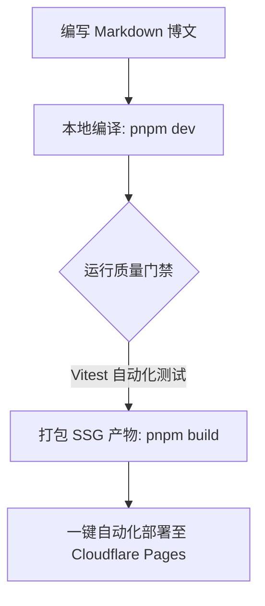

# 富媒体与技术图表演示

本篇示例文章展示本博客模板强大的高级渲染特性。

## 一、 相对路径图片与灯箱放大

下面的插图支持点击平滑放大：

## 二、 Mermaid 技术架构图原生渲染

内置 `vitepress-plugin-mermaid`，直接在 Markdown 中编写 Flowchart 或 Sequence 时序图：

## 三、 置顶图钉机制

通过在 FrontMatter 中设置 `order: number`（数值越大越靠前），即可让关键文章优先固定在首页顶部并显示 📌 图钉。
